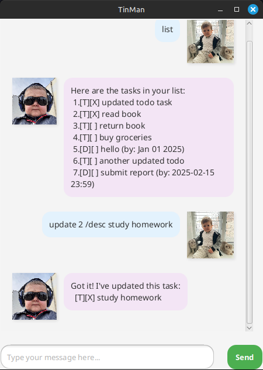

# TinMan User Guide

TinMan is a personal task management assistant that helps you manage todos, deadlines, and events.

## Quick Start

1. Ensure you have Java 17 installed.
2. Download `tinman.jar`.
3. Run `java -jar tinman.jar` to start the application.
4. Type commands and press Enter.

## Features

### Adding Tasks

- **Todo**: `todo DESCRIPTION`
  - Example: `todo read book`

- **Deadline**: `deadline DESCRIPTION /by DATE`
  - Example: `deadline submit assignment /by 2023-12-01 2359`

- **Event**: `event DESCRIPTION /from START /to END`
  - Example: `event meeting /from Mon 2pm /to Mon 4pm`

### Managing Tasks

- **List all tasks**: `list`
- **Mark task as done**: `mark INDEX`
- **Unmark task**: `unmark INDEX`
- **Delete task**: `delete INDEX`
- **Find tasks**: `find KEYWORD`
- **Update task**: `update INDEX /PARAMETER VALUE`
- **Exit**: `bye`

### Update Examples

- **Update description**: `update 1 /desc new task name`
- **Update deadline**: `update 2 /by tomorrow 5pm`
- **Update event times**: `update 3 /from 2pm /to 4pm`
- **Update event with description**: `update 3 meeting /from 2pm /to 4pm`

## Notes

- Task numbers start from 1
- Dates can be flexible: `tomorrow`, `next Friday`, `2023-12-01 1800`
- Tasks are automatically saved